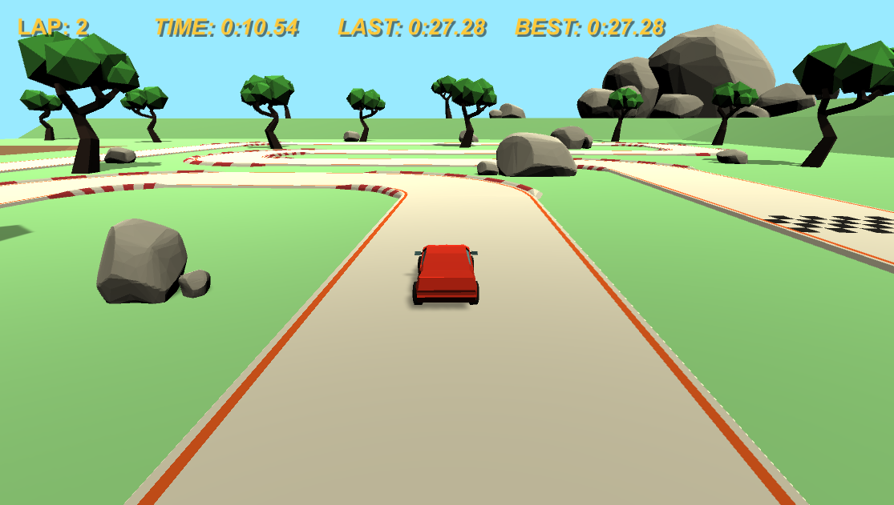

# Karting Game

## Table of contents
* [Overview](#overview)
* [Examples](#examples)
* [Technologies](#technologies)
* [Usage](#usage)
* [Limitations](#limitations)

## Overview
This is a 3D, low-poly racing game made in Unity. You play as a kart and you race around the track trying to set a best time. The game keeps track of how many laps you have completed, as well as your all time best lap time and your current lap time.

## Examples

> Screenshot of the game

> Driving around the track

## Technologies
- Unity 2019.3.1
- Blender 2.83
  - Blender files are stored in the *./Blender* folder.

## Usage

This game can be played [here](https://simmer.io/@Alex0Blackwell/karting-game)!  
This repository contains everything needed to get the project up and running on Unity. Just clone the repository and open the project in Unity to edit the game yourself.

## Limitations

- [ ] Multiplayer
  - The game cannot be played online
- [ ] ML Bots
  - The game does not feature bots to race against

## Contributors
- *Daniel Ko*
  - Car model, track model, ground model, work an car
- *Alex Blackwell*
  - Tree model, rock model, camera follow, car movement, lap system

## License
Licensed under the [GNU General Public License v3.0](LICENSE).
